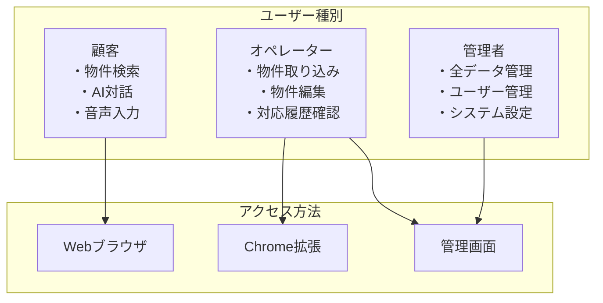
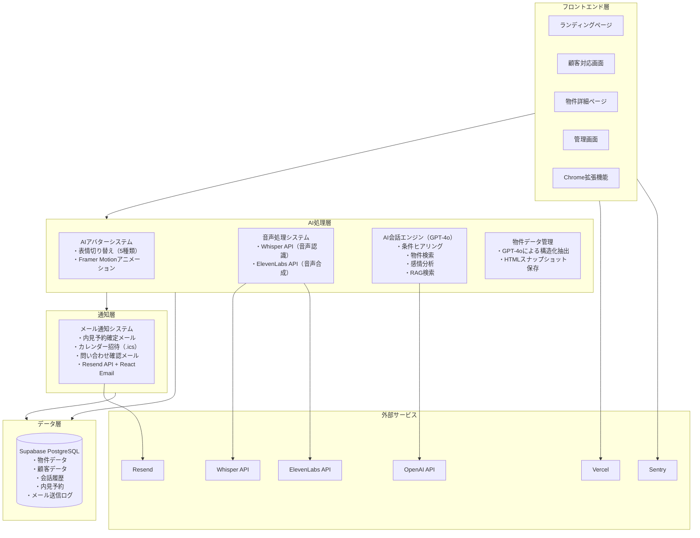
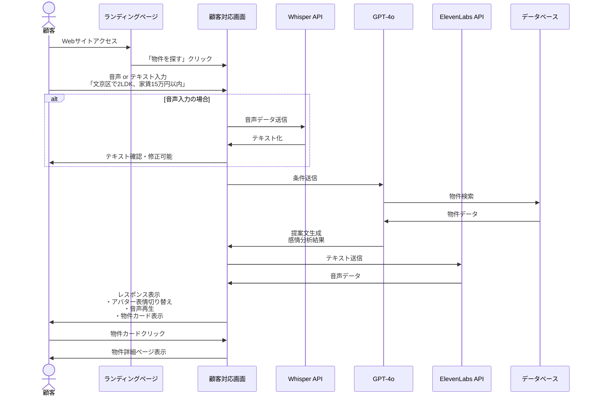
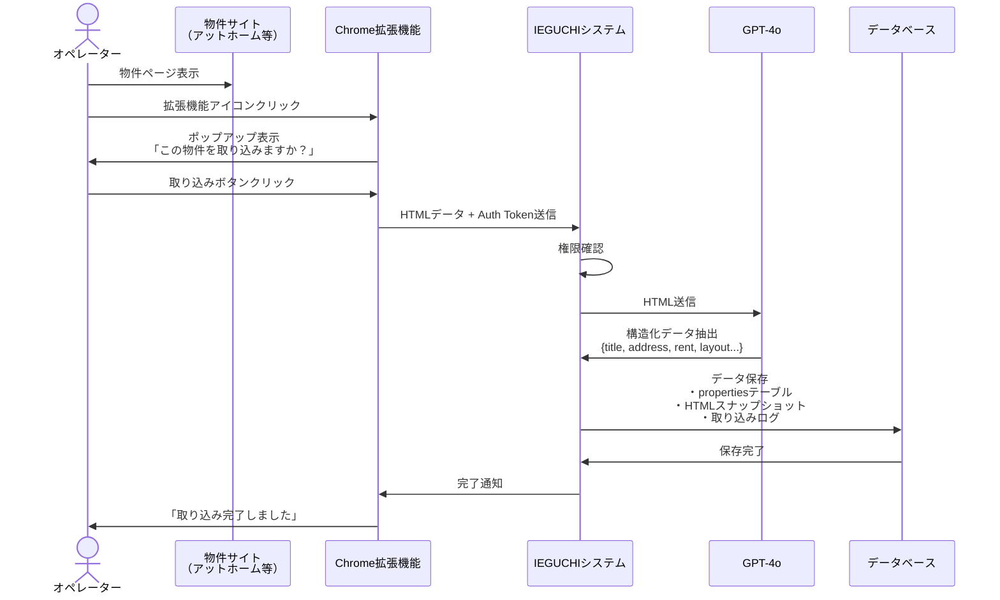
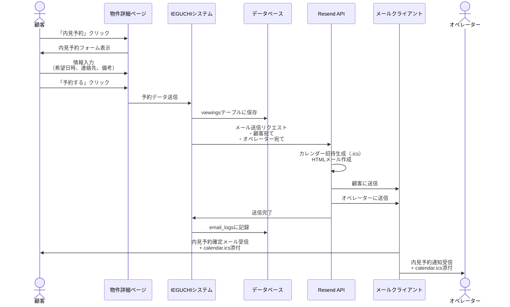
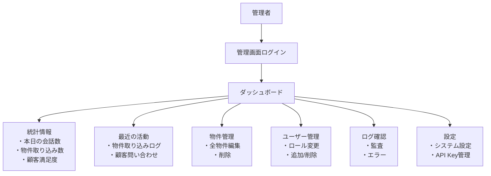

# IEGUCHI システム全体像・アーキテクチャ設計書

> 機能仕様に関する認識合わせ用ドキュメント

---

## 目次

1. [システム概要](#システム概要)
2. [システム全体構成](#システム全体構成)
3. [主要機能フロー](#主要機能フロー)
4. [画面構成](#画面構成)
5. [技術スタック](#技術スタック)
6. [セキュリティ対策](#セキュリティ対策)
7. [システムの特徴](#システムの特徴)

---

## システム概要

IEGUCHIは、不動産業界向けの窓口営業支援AIアシスタントシステムです。AIアバター「イエグチさん」が顧客対応を行い、24時間365日の物件検索・提案を実現します。

### 主な機能

- AI会話による物件検索・提案
- 音声入力対応（高齢者にも配慮）
- アバターによる視覚的なコミュニケーション
- Chrome拡張機能による効率的な物件登録
- 内見予約の自動化とメール通知

---

## システム全体構成

### ユーザー種別と権限

### システムアーキテクチャ

---

## 主要機能フロー

### 1. 顧客の物件検索フロー

### 2. オペレーターの物件取り込みフロー

### 3. 内見予約・メール通知フロー

### 4. 管理者のダッシュボード利用フロー

---

## 画面構成

本システムは以下の7つの主要画面で構成されます。

### 1. ランディングページ（LP）

**目的**: サービスの特徴を紹介し、顧客を物件検索へ誘導

**主要要素**:
- サービスロゴとキャッチコピー
- 主要機能の紹介（24時間対応、音声検索、高齢者対応）
- 「物件を探す」CTA（Call To Action）ボタン

### 2. 顧客対応画面（メイン画面）

**目的**: AIアバターとの対話による物件検索

**主要要素**:
- AIアバター「イエグチさん」の表示
- 会話履歴エリア
- 音声入力ボタン
- テキスト入力フォーム
- 物件カード表示エリア（検索結果）

### 3. 物件詳細ページ

**目的**: 選択した物件の詳細情報を表示

**主要要素**:
- 物件写真スライダー
- 基本情報（家賃、間取り、住所）
- 詳細情報（設備、アクセス、間取り図）
- 内見予約ボタン
- 問い合わせボタン

### 4. 物件一覧ページ

**目的**: 条件に合致する物件の一覧表示と絞り込み

**主要要素**:
- 検索条件フィルター（エリア、家賃、間取り等）
- 検索結果件数表示
- 物件カード一覧
- ページネーション

### 5. 管理画面（オペレーター用）

**目的**: オペレーターによる物件管理と対応履歴確認

**主要要素**:
- 自分が取り込んだ物件一覧
- 物件の編集・削除機能
- 取り込みログ表示
- 顧客対応履歴

### 6. ダッシュボード（管理者用）

**目的**: システム全体の状況把握と管理

**主要要素**:
- 統計情報（会話数、物件取り込み数、顧客満足度）
- グラフ表示（会話数推移等）
- 最近の活動ログ
- 各管理機能へのナビゲーション

### 7. 設定ページ

**目的**: システムの各種設定とカスタマイズ

**主要要素**:
- アバター設定（表情切り替え速度、デフォルト表情）
- 音声設定（速度、音量）
- API設定（管理者のみ: OpenAI API Key、ElevenLabs API Key等）

---

## 技術スタック

### フロントエンド

| 技術 | バージョン | 用途 |
|------|-----------|------|
| Next.js | 15 | Reactフレームワーク |
| React | 19 | UIライブラリ |
| TypeScript | 5.x | 型安全な開発 |
| Tailwind CSS | 3.x | スタイリング |
| shadcn/ui | - | UIコンポーネント |
| Framer Motion | - | アニメーション |

### バックエンド

| 技術 | 用途 |
|------|------|
| Supabase | データベース（PostgreSQL）、認証、ストレージ |
| Vercel | ホスティング、サーバーレス関数 |

### AI・音声処理

| サービス | 用途 |
|---------|------|
| OpenAI GPT-4o | AI会話エンジン、構造化データ抽出 |
| Whisper API | 音声認識（音声→テキスト） |
| ElevenLabs API | 音声合成（テキスト→音声） |

### 通知・メール

| サービス | 用途 |
|---------|------|
| Resend | メール配信 |
| React Email | HTMLメールテンプレート |

### 監視・ログ

| サービス | 用途 |
|---------|------|
| Sentry | エラー監視 |
| Axiom | ログ管理 |

### Chrome拡張機能

| 技術 | 用途 |
|------|------|
| Manifest V3 | Chrome拡張機能の仕様 |
| TypeScript | 拡張機能のロジック |

---

## セキュリティ対策

### 認証・認可

**実装内容**:
- Supabase Authによるユーザー認証（JWT）
- Row Level Security（RLS）による細密な権限制御
- ロールベースアクセス制御（RBAC）
  - customer: 物件検索、問い合わせ
  - operator: 物件取り込み、自分の物件編集
  - admin: 全データ管理、ユーザー管理

### データ保護

**実装内容**:
- HTTPS通信の強制
- データベースの暗号化（at rest）
- 通信データの暗号化（in transit）
- 機密情報（API Key等）の環境変数管理

### 監査・ログ

**実装内容**:
- 物件取り込みログの記録（法的証跡）
- HTMLスナップショットの保存（取り込み時点の証拠）
- ユーザーアクセスログの記録
- セキュリティイベントの監視

### コンプライアンス

**対応項目**:
- 個人情報保護法への対応
- 不動産広告規制への準拠
- データ保持期間の設定と自動削除

---

## システムの特徴

### 実現可能な機能

- ✅ 24時間365日のAI自動物件提案
- ✅ 音声入力による物件検索（高齢者対応）
- ✅ 感情表現豊かなアバター表示（5種類の表情）
- ✅ Chrome拡張機能によるワンクリック物件取り込み
- ✅ ロールベースのセキュアな権限管理
- ✅ 会話履歴の記録と分析
- ✅ 内見予約の自動メール通知
- ✅ カレンダー招待ファイル（.ics）の自動生成
- ✅ 問い合わせ受付確認メールの自動送信
- ✅ システムお知らせメールの一斉配信

### 実現できない機能

- ❌ 3Dアバター（2D静止画のみ対応）
- ❌ リアルタイム動画通話機能
- ❌ 完全自動の物件取り込み（オペレーターの操作が必要）
- ❌ オペレーターのスケジュール自動調整（予約受付・通知まで）

---

## 次のステップ

### ご確認いただきたい事項

本ドキュメントは、システムの機能仕様に関する認識の相違がないかを確認するためのものです。以下の点についてご確認をお願いいたします。

1. **システム仕様の確認**
   - 記載された機能要件に過不足がないか
   - 追加・変更のご要望がないか
   - 実現できない機能についての認識が一致しているか

2. **技術スタックの確認**
   - 採用する技術に問題がないか
   - 長期運用の観点からの懸念点がないか

3. **画面構成・UIの確認**
   - 必要な画面がすべて含まれているか
   - 各画面の機能要件が適切か

ご質問やご不明な点、変更のご要望等がございましたら、お気軽にご連絡ください。

---

**発行者**: 小松原遼羽  
**メールアドレス**: r.kono17y204@gmail.com  
**電話番号**: 070-1317-5266  
**発行日**: 2025年11月15日  
**バージョン**: 1.0
